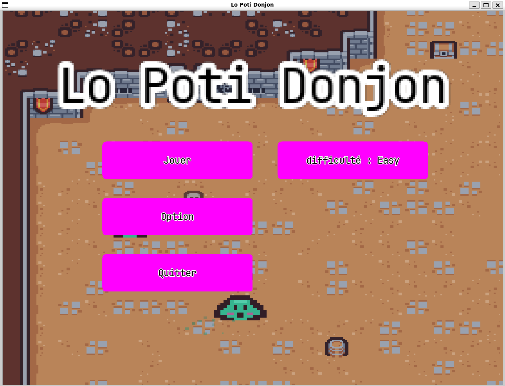
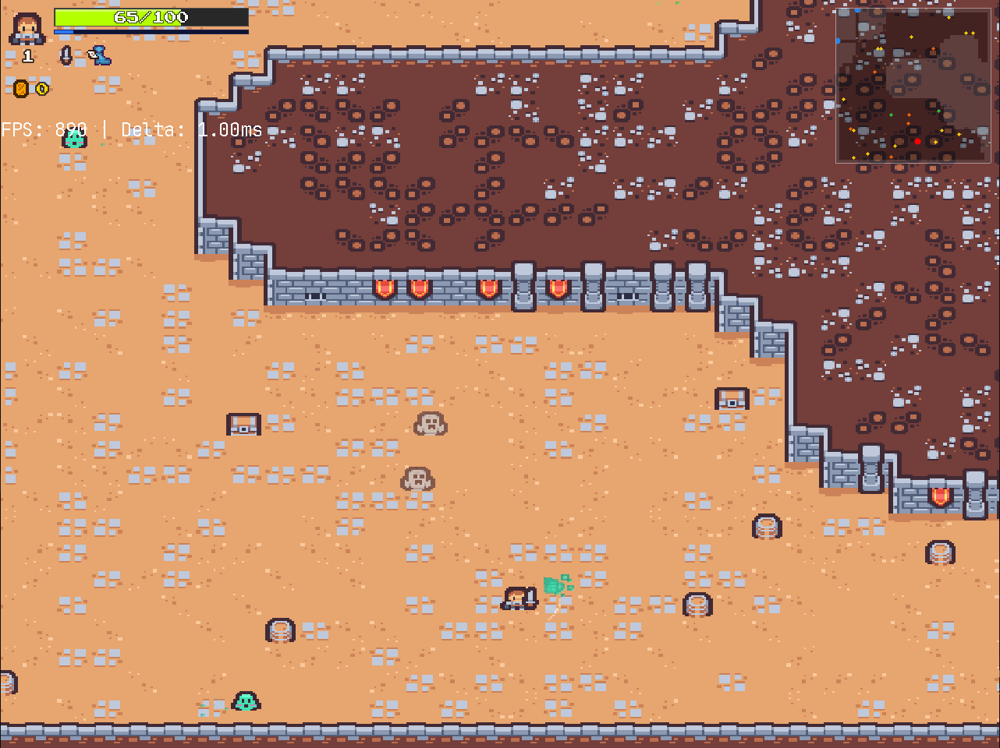
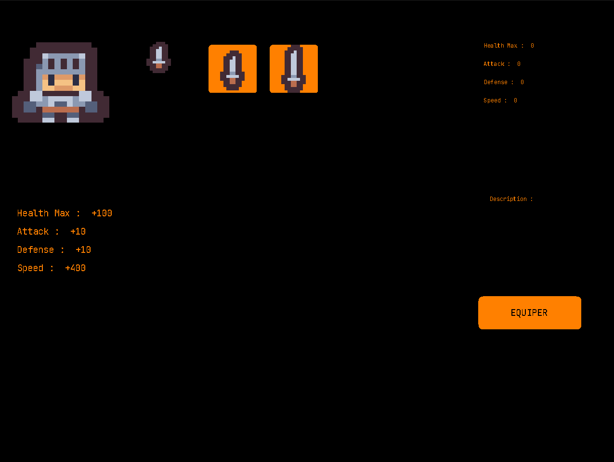
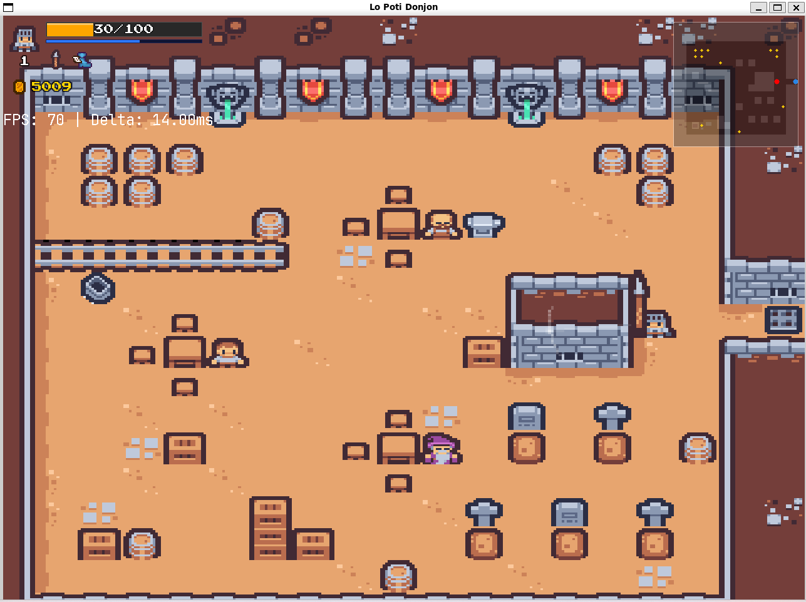
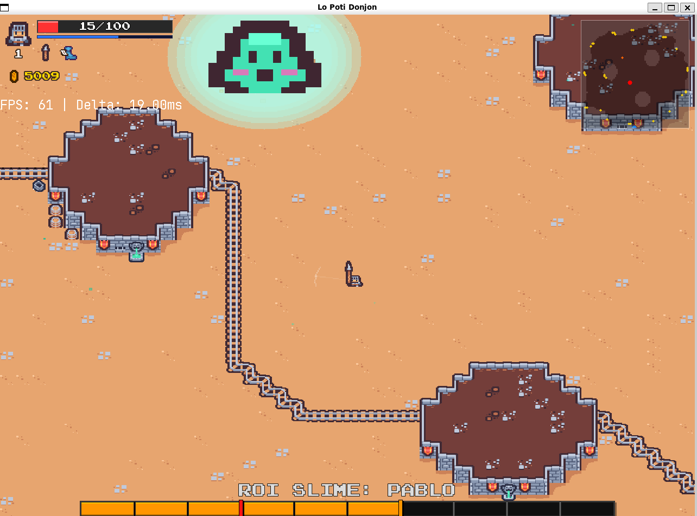

# Ubissauphte 

Bienvenue sur le projet **Lo Poti Donjon**, créé par **Ubissauphte**, un projet de fin d'année 2024-2025 pour la L2 informatique.

## Table des matières
1. [Contributeurs](#contributeurs)
2. [Principe du jeu](#principe-du-jeu)
3. [Histoire du jeu](#histoire-du-jeu)
4. [Fonctionnalités du jeu](#fonctionnalités-du-jeu)
5. [Liens](#liens)
6. [Installation du jeu](#installation-du-jeu)
7. [Images du jeu](#images-du-jeu)


## Contributeurs

Voici les membres de l'équipe ayant contribué au projet :

- **Souleymane Barry** *(souley-b)*
- **Barthélémy Derouault** *(Pigi-bytes)*
- **Victor Fombertasse** *(Michele530)*
- **Baptiste Carfantan** *(Baptcarf)*


## Principe du jeu :

**Lo Poti Donjon** est un jeu de type **rogue-like** où le joueur doit se préparer pour survivre le plus longtemps possible dans un donjon rempli de dangers et de monstres.

## Histoire du jeu

Dans **Lo Poti Donjon**, vous incarnez un aventurier égaré dans le vaste donjon de Pablo, dépouillé de toutes ses capacités. Pour récupérer ce qui lui revient de droit, vous devrez traverser un long périple semé de pièges et de monstres déterminés à protéger leur domaine.

Le donjon abrite un antagoniste puissant et impitoyable, représentant l'ultime défi. Votre aventure s'achève une fois cet ennemi vaincu.

Pour surmonter ces épreuves, vous devrez allier force et stratégie afin d'augmenter votre puissance et mettre fin au règne de Pablo. Vous commencez avec une simple dague, mais en explorant, vous pourrez :

- Ouvrir des coffres contenant divers objets.
- Accumuler des pièces pour acheter des armes de différentes raretés auprès des marchands.
- Découvrir des équipements rares, comme la **Double Hache de Guerrier Légendaire**.

## Fonctionnalités du jeu :

Lors du lancement, le programme génère un niveau et ses salles en fonction de la difficulté choisie par le joueur :

- **Easy** : 7 salles avec 5 monstres par salle.
- **Normal** : 17 salles avec 10 monstres par salle.
- **Hard** : 22 salles avec 20 monstres par salle.
- **Demonic** : 32 salles avec 30 monstres par salle.
- **Legendary** : 102 salles avec 50 monstres par salle.

### Points clés :
- **Temps de chargement** : Les salles sont générées au début de la partie pour éviter des latences lors des changements de carte.
- **Objectif** : Tuer les monstres dans chaque salle pour progresser.
- **Équipements** : Trouvez des objets dans les coffres ou achetez-les auprès des marchands pour affronter le boss final.
- **Système de niveau** : Le jeu est punitif, mais chaque montée de niveau restaure entièrement la vie du joueur.

## Comment jouer

Dans **Lo Poti Donjon**, vous utilisez les touches suivantes par default pour vous déplacer et interagir :

- **Z/Q/S/D** : Déplacements du personnage.
- **Espace** : Dash.
- **E** : Intéragir.
- **I** : Ouvrir l’inventaire.
- **Échap** : Accéder au menu principal ou revenir en 
- **p** ; ouvrir la carte.
 
## Liens

### Diagrammes et documentation
- [Diagramme de Gantt Prévu](https://docs.google.com/spreadsheets/d/1izmjEU3AdizAlb6oVq4sjDTDMpQiwE0Ea9UwfN2fawg/edit?usp=sharing)
- [Diagramme de Gantt Réel](https://docs.google.com/spreadsheets/d/1kdkzD_GTPsmrwCW2jH0_2ET8rOUeqwklMZoLPcJabdQ/edit?usp=sharing)
- [Documentation Doxygen](https://pigi-bytes.github.io/Ubissauphte/index.html)

### Ressources utilisées
- **Fonts** :
  - [JetBrains Mono](https://www.jetbrains.com/lp/mono/)
  - [Zone38 Fonts](https://www.zone38.net/font/)
- **Tileset** :
  - [Tiny Dungeon by Kenney](https://kenney-assets.itch.io/tiny-dungeon)

- **Musiques** :
  - [Waterflame](https://www.youtube.com/@WaterflameMusic) :
    - [Field of memories](https://youtu.be/rVTzv9qLyko?si=NbDb3IJQC-m9wbWO)
    - [Field of memories 2](https://youtu.be/yolbGaJD4AY?si=Bzbz0czA9FRo_Toc)

## Installation du jeu :
Avant de compiler le projet, assurez-vous que les dépendances suivantes sont installées sur votre système :  

- **SDL2** : Bibliothèque principale.
- **SDL2_mixer** : Pour la gestion des sons.
- **SDL2_ttf** : Pour l'affichage des polices.


Sur un système Linux (par exemple Ubuntu), vous pouvez installer ces dépendances avec la commande suivante :  

```bash 
sudo apt-get install libsdl2-dev libsdl2-mixer-dev libsdl2-ttf-dev 
```

Une fois les dépendances installées, suivez les étapes ci-dessous pour compiler et exécuter le projet :

- Clonez le dépôt GitHub :
```bash 
git clone https://github.com/Pigi-bytes/Ubissauphte.git
```

- Accédez au répertoire du projet :
```bash
cd Ubissauphte
``` 

- Compilez le projet avec make :
```bash
make all
```

- Lancez le jeu :
```bash
./bin/Ubissauphte 
```

## Exemple de débogage

Voir le rapport : [rapport débogage](/rapportDebugAvecGDB.pdf)

## Image du jeu







